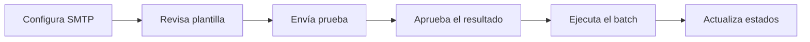

# 🚀 U4U Mailer Studio

<div align="center">
  
  
  
  
  <br /><br />
  <h3>Envíos masivos con estilo, control y trazabilidad</h3>
  <p>Gestiona plantillas, SMTP, adjuntos y estados de contacto desde una interfaz simple y potente.</p>
</div>

## ✨ Vista rápida del flujo



## 🎯 Características

- Interfaz gráfica para administrar SMTP, plantilla y configuración.
- Envío de pruebas antes del lote real.
- Control de estados de contactos: Pendiente, Enviado, Error, Baja, etc.
- Soporte para adjuntos opcionales.
- Vista rápida del contenido del CSV y resumen de estados.

## 🌟 Lo que hace especial al proyecto

- Diseñado para reducir errores humanos en campañas masivas.
- Permite revisar cada paso antes de disparar el lote real.
- Mantiene el flujo de trabajo claro: prueba, aprobación y envío.

## 🛠️ Requisitos

- Python 3.10 o superior
- Paquetes listados en [requirements.txt](requirements.txt)

## ▶️ Instalación y uso

1. Instala dependencias:
   ```bash
   pip install -r requirements.txt
   ```

2. Crea tu archivo de entorno local:
   ```bash
   copy .env.example .env
   ```

3. Edita .env con tus datos SMTP y preferencias.

4. Inicia la interfaz:
   ```bash
   python abrir_interfaz.py
   ```

## 📁 Estructura principal

- [abrir_interfaz.py](abrir_interfaz.py): arranque de la aplicación.
- [interfaz_u4u.py](interfaz_u4u.py): interfaz gráfica.
- [enviar_correos.py](enviar_correos.py): motor de envío y manejo de contactos.
- [plantilla_u4u.html](plantilla_u4u.html): plantilla activa.
- [adjuntos](adjuntos): carpeta para archivos que se pueden adjuntar a los correos.
- [tests](tests): pruebas básicas del flujo de estados.

## 🔐 Importante

No subas datos reales de contactos, credenciales SMTP ni archivos sensibles. El proyecto ya incluye un .gitignore preparado para eso.

## 💡 Sugerencia

Antes de enviar lotes reales, ejecuta una prueba y apruébala desde la interfaz para activar el envío del batch.
